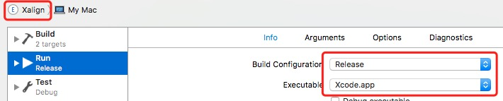
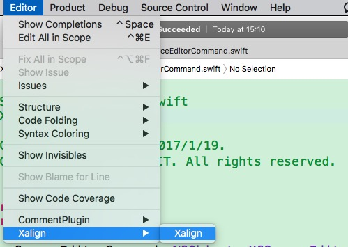
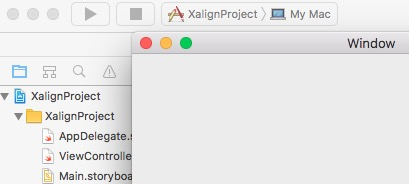
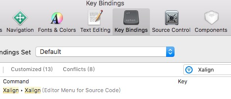
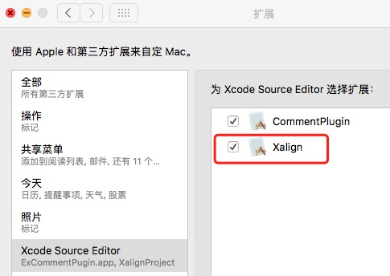
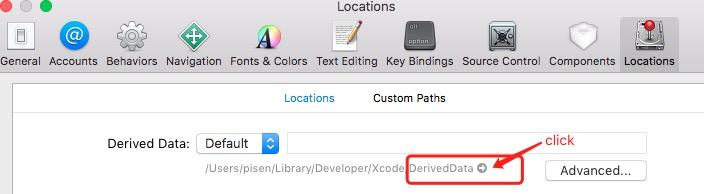
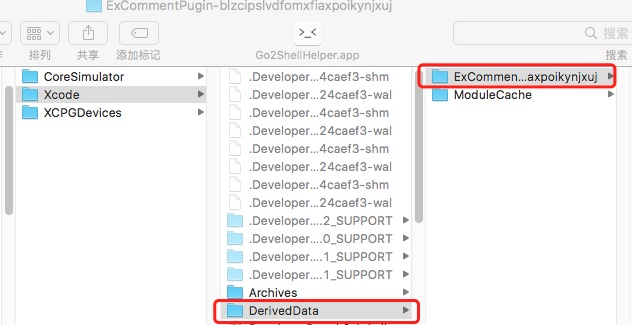
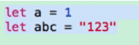
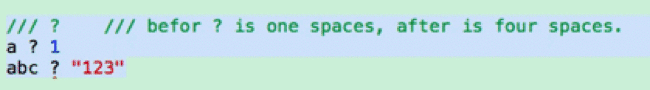

# Xalign

`Xalign` is plugin for Xcode8, which can algin codes with "=", also can custom it.

## Requirements

- Xcode 8.0+
- Swift 3.0+

## Installation

1. Edit Scheme `Xalign` 
2. Run `Xalign `, which will create a new gray Xcode, then you can find `Xalign ` in `Editor`. 
3. Close the gray Xcode, Run the `XalignProject`, then will create a **mac app**. 
4. Close the normal Xcode, reopen the normal Xcode. Open a project, select a file. If yo find `Xalign ` in `Editor`, you can use the plugin now.
5. You can set the **hotkey** for `Xalign `. 

## UnInstallation
1. You can manager the Plugins in `System Perference`, for setting the plugins hidden or not. 
2. You can also open the folder **/Xcode/DerivedData**, and delete folder **XalignProject**. 

## Usage
1. default is `=`.  
2. custom  